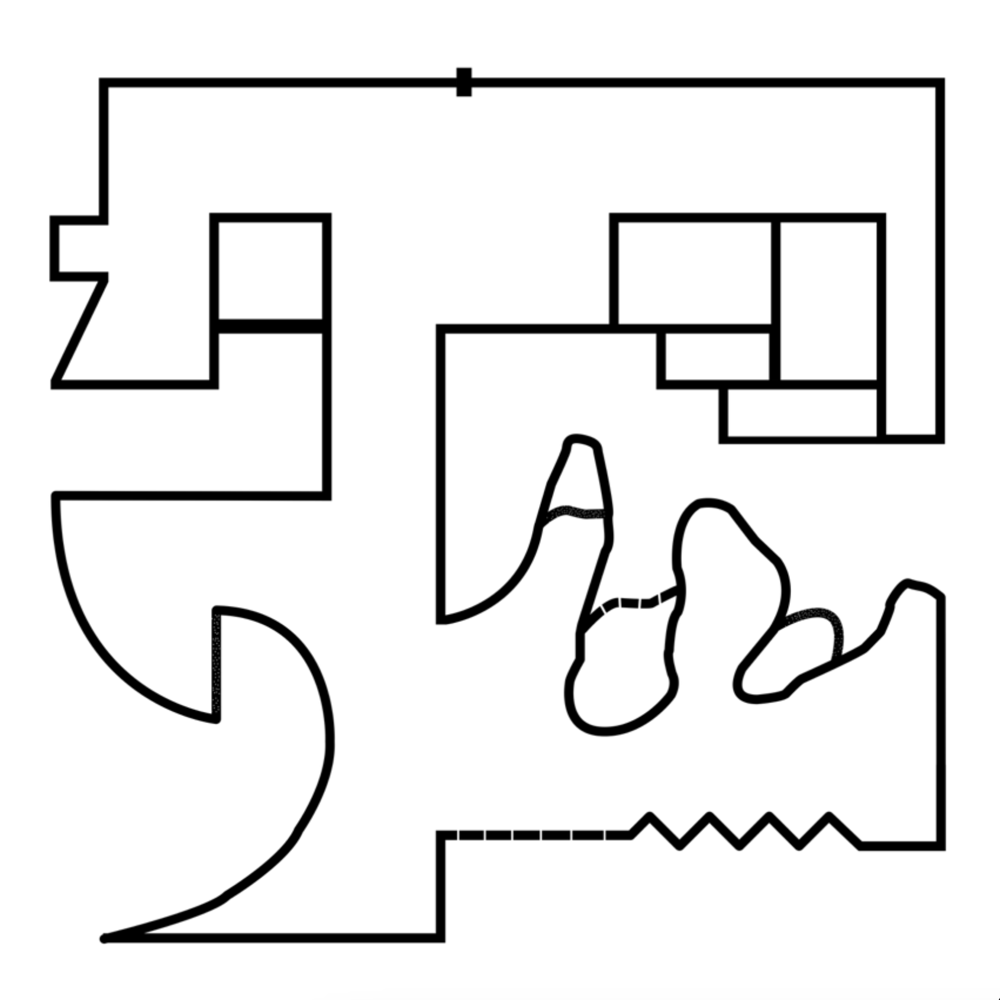
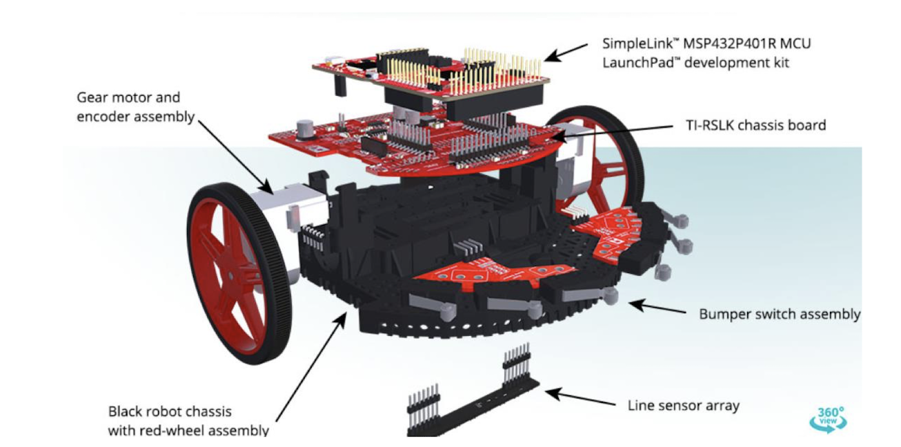

#Main Track

## 조건
### 1. 위의 트랙을 2바퀴 돌아야 한다.
### 2. 트랙의 크기는 2m * 2m 이다.
### 3. 길 중간 중간에 Noise을 처리해 주어야 한다.

## 사용 모델
### TI-RSLK MAX

### Line Tracer 예시 : https://www.youtube.com/watch?v=CBfTkGgLijY

## Road Size
### - 19mm (2 센서, default)
### - 15mm ~ 30mm

# 결과물

